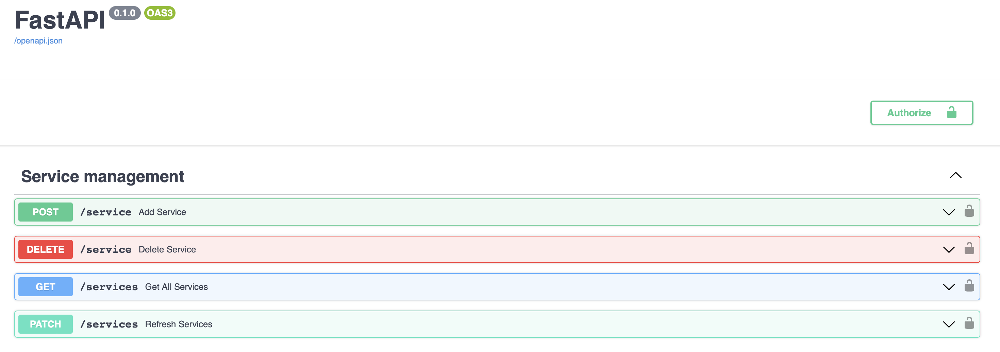

# Security


## 1. Tag x-enable-auth-in-api-gateway

In order for the API-Gateway to understand which urls and microservices need to be secured, first you need to set `x-enable-auth-in-api-gateway` tag to the group of tags that you want to secure.

=== "app.py"

    ```python
    from fastapi import FastAPI
    import uvicorn

    tags_metadata = [
        {
            "name": "users",
            "description": "Operations with users. The **login** logic is also here.",
            "x-auto-generate-in-api-gateway": False,
            "x-enable-auth-in-api-gateway": False, # (1)!
        },
        {
            "name": "items",
            "description": "Manage items. So _fancy_ they have their own docs.",
            "externalDocs": {
                "description": "Items external docs",
                "url": "https://fastapi.tiangolo.com/"
            },
            "x-auto-generate-in-api-gateway": True,
            "x-enable-auth-in-api-gateway": True, # (2)!
        },
    ]

    app = FastAPI(openapi_tags=tags_metadata)


    @app.get("/users/", tags=["users"])
    async def get_users():
        return [{"name": "Harry"}, {"name": "Ron"}]


    @app.get("/items/", tags=["items"])
    async def get_items():
        return [{"name": "wand"}, {"name": "flying broom"}]

    if __name__ == '__main__':
        uvicorn.run(app, port=5000, log_level="info")
    ```

    1. We explicitly say that security for the url group "users" is not needed. 
    2. Enabling security for the "items" group

## 2. Security class

To ensure security, it is necessary to create a class that will inherit from the HTTPBearer class.

For example, let's create a `FakeJWT` class.


=== "FakeJWT.py"

    ```python
    class FakeJWT(HTTPBearer):
        def __init__(self, service_name, path, path_method):
            super(FakeJWT, self).__init__()
            self.service_name = service_name
            self.path = path
            self.path_method = path_method

        async def __call__(self, request: Request):

            credentials: HTTPAuthorizationCredentials = await super(FakeJWT, self).__call__(request)

            logger.info(f"{self.service_name}, {self.path}, {self.path_method}")

            if credentials:
                if not credentials.scheme == "Bearer":
                    raise HTTPException(
                        status_code=403, detail="Invalid authentication scheme.")
                if credentials.credentials != "test":
                    raise HTTPException(
                        status_code=403, detail="Invalid token or expired token.")
                return credentials.credentials
            else:
                raise HTTPException(
                    status_code=403, detail="Invalid authorization code.")
    ```

If the microservice has set the tag `x-enable-auth-in-api-gateway`, you get three arguments with each request.

| Argument       | Description       |
| -------------- | ----------------- |
| `service_name` | Microservice name |
| `path`         | URL address       |
| `path_method`  | HTTP method       |

!!! abstract
    In the class for security, you can implement any logic. For example, create a separate microservice for the security of microservices and send requests via httpx.

## 3. Add to Config 

After creating a class, you can add a link to your class to connect all microservices to it.

=== "app.py"

    ```python
    
    ...

    config = Config(
        fast_api_app=app,
        jwt=FakeJWT # (1)!
    )

    autoRG = Generator(
        config=config
    )

    if __name__ == "__main__":
        uvicorn.run(app=app, port=12000, log_level="info")
    ```

    1. Passing the class inherited from HTTPBearer

!!! info
    By default, if a class for security has been provided in the configuration, the URLs for managing microservices will be automatically protected. This can be observed by looking in Swagger.

|                   |
| ----------------------------------------------------------- |
| <p align="center"> **URLs protected by Bearer token**  </p> |
